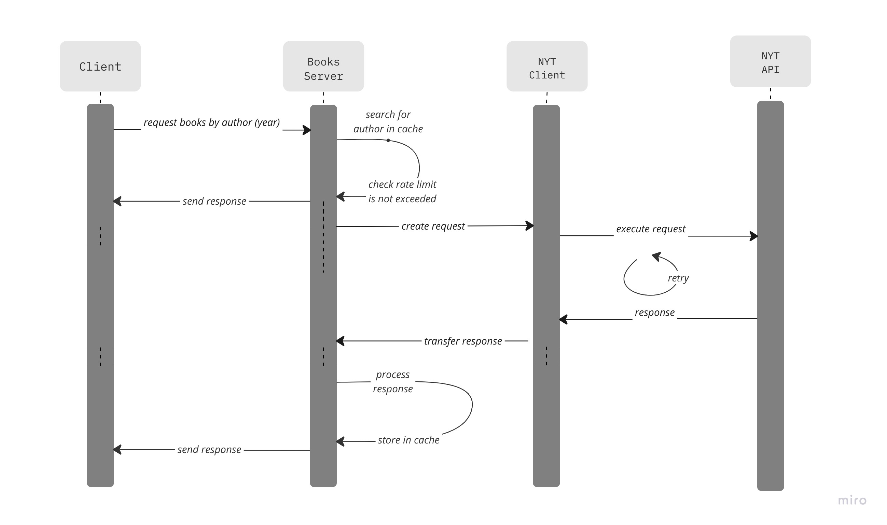

# Books API Server

This project implements an api service that gets all books by a specified author that have appeared on the New York
Times Bestsellers list.

It sources this information from
the [New York Times Books api](https://developer.nytimes.com/docs/books-product/1/routes/lists/best-sellers/history.json/get).

## Architecture

A high level overview of the flow of requests and responses is shown:



The components of this service include:

- Finch server with endpoints serving client requests
- Finagle client executing requests to the New York Times api
- Service that processes responses from the New York Times api to match the domain model
- Configuration loader
- In-memory cache, caching responses which expire after a specified duration.
- Logging middleware
- Request-meter middleware restricting the number of calls to the New York Times API to avoid rate limited responses
- Admin server that provides an interface with variety of tools for diagnostics, profiling, monitoring e.t.c

### Server

This server is built using [finch](https://finagle.github.io/finch/), it runs on specified port, the default is `8087`.
An admin server as defined above is also started, this server runs on port `9990`.

#### Routes

- get all books from a specified author that have appeared on the New York Times bestsellers list

```shell
GET :8087 /books/author=<author>&year=<year>&year=<year>  

{
    "author": "cal newport",
    "books": [
        {
            "name": "A WORLD WITHOUT EMAIL",
            "publisher": "Portfolio",
            "publicationYear": "2021"
        },
        {
            "name": "DIGITAL MINIMALISM",
            "publisher": "Portfolio/Penguin",
            "publicationYear": "2019"
        }
    ]
}
```

`author` & `year` params are validated by the server. `author` is a required param while `year` is optional.
`author` param is expected to be non-empty and `year` param is expected to match `^(\\d{4})$` which represents `YYYY`
format.

- admin interface with default port `:9990`
- health check endpoint `:9990/health`

### Client

The service depends on a [finagle client](https://twitter.github.io/finagle/guide/Clients.html) that executes requests
to the New York Times api. Its functionalities include:

- jittered back off retry for non `rate limitation` (`429`) errors
- session pool so connections can be reused for multiple requests
- requests with timeout so request wait forever

### Caching

Responses from the New York Times api are cached for a default time (`3 minutes`). Subsequent requests for related
queries are served from the cache and thereby faster and less risk for the requests to the New York Times api to be rate
limited.

### Request metering

Request metering is implemented as the New York Times api dependency
implements [rate limits](https://developer.nytimes.com/faq#a11) on calls. There is a rate limit of `500` requests per
day and `5` requests per minute.

This implies for this service, calls have to be metered to avoid hitting the rate
limits. [Meters](https://twitter.github.io/util/docs/com/twitter/concurrent/AsyncMeter.html)
are [implemented](/src/main/scala/com/idarlington/books/middleware/RequestMeter.scala) for both the minute and daily
limit. If a request to the service has a previous New York Times api cached it is not metered.

## Running the application

To start the service, export your New York Times api key and run the command

```shell
export NYT_API_KEY=<key>

sbt run
```

By default, the api server runs on `:8087` and the admin server runs on `:9990`.

### Tests

```shell
sbt test
```

## Assumptions and design choices

## Improvements

This implementation can be improved in these areas:

- pagination of responses to clients
- more metrics
- more unit tests for components
- integration testing
- supervising the created resources